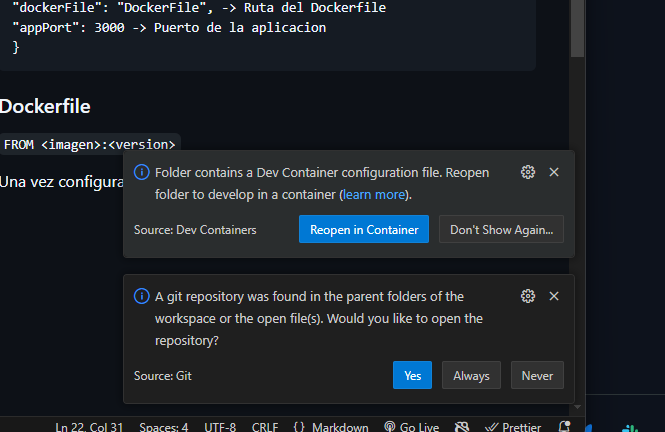

# DOCKER EN VSC - BASICO

### Instalar la extension Remote Development (Remote Containers)

El plugin trabaja buscando un carpeta llamada '**.devcontainer**'

Dentro de la carpeta, se debe crear una archivo json (configuracion)
**devcontainer.json**

### JSON 'devcontainer.json'
    {
    "name": "Docker node", -> Nombre del contenedor
    "dockerFile": "DockerFile", -> Ruta del Dockerfile
    "appPort": 3000 -> Puerto de la aplicacion
    }

### Dockerfile

`FROM <imagen>:<version>` 

Una vez configurado el entorno, cerramos VSC y lo abrimos desde terminal 'code .' 

Ya abierto, salta una alerta 

Clickeamos en 'Reopen in Container' y esperamos a que se descargue la imagen 'pull' con las versiones descargadas

Cerramos terminal y observamos los contenedores corriendo

`docker ps`

Si abrimos la terminal, se abre la terminal directamente 

### Terminal

`touch <nombre_archivo.extension>`

`corremos servidor`

`ejecutar servidor`

**Mapear puerto para ejecutar servidor**

    Ctrl + Shift + P 

    Buscamos -> Forward Port from container

    Nos permite hacer un 'ssh forward' lo que significa que redirigiremos todo el tráfico del contenedor al host

