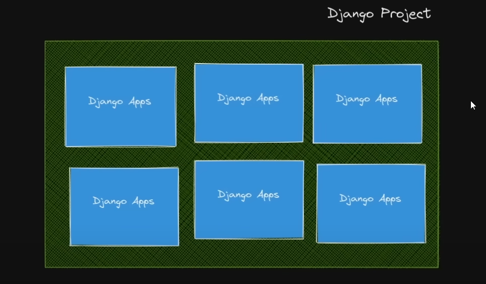

# CURSO DJANGO

### Django es un Framework para desarrollar aplicaciones 

**Comando consola version de Django**

`django-admin --version`

`python -m  django --version`

## Crear proyecto de Django

**Iniciar proyecto**

`django-admin startproject <nombre-de-proyecto>`

** o **

**Iniciar proyecto en el mismo directorio en el que se esta trabajando (Recomendada)**

`django-admin startproject <nombre-de-proyecto> .`


## Uso de manage.py

**Esturctura Base**

`python manage.py`

**Correr Servidor**

`python manage.py runserver`

**Comandos de ayuda**

`python manage.py --help`

Muestra todos los comando de django

**Caracteristicas**

- Servidor local usado - http://127.0.0.1:8000/
- Base de Datos por defecto - db.sqlite3

> Para cambiar de servidor es `python manage.py runserver <numero-puerto>`

## Estructura del proyecto

- manage.py
  - Se usa para poder ejecutar comandos que ayudan a la administracion del proyecto
- db.sqlite3
  - Base de datos de la aplicacion
  - Se puede cambiar la base de datos
- Capeta proyecto (Nucleo de la Aplicacion)
  - __init__
  - asgi.py
  - wsgi.py
    - Tanto asgi.py & wsgi.py sirve para servir el contenido
  - settings.py (Mas Importante)
    - Archivo para la configuracion del proyecto
  - urls.py
    - Urls del proyecto


## Apps

**Los proyectos en Django estan constituidos por diferentes aplicaciones, es decir, si creas 
una pagina web que se dedique a hacer venta de muebles, puedes separar ese proyecto por partes
y funcionalidades, una app en este caso que solo se dedique al area de pagos, otra al area de 
autenticacion de usuarios, otra a la exposicion de los productos**



### Configuracion de aplicaciones

**Se deben de añadir al archivo de la aplicacion a
'settings.py' del proyecto principal en la lista 'INSTALLED_APPS'**

### Como crear apps?

`python manage.py startapp <nombre-app>`

Cada carpeta de la app tiene archivos que son para especificar las funcionalidades de cada app

### Estructura de una App

- migration
  - Carpeta que se llenara cuando hagamos modificaciones en la base de datos
  - En Django no necesitaremos consultas en sql, si no que ocupa un modulo especial llamado
    ORM, que nos permite interactuar con la base de datos a traves de codigo python
- __init__
- admin.py
  - Añadir las aplicaciones al panel de administrador principal de Django
- apps.py
  - Configuracion de la aplicacion, parecido a settings.py, pero exclusico de la app
- models.py
  - Crear Clases que se convierten en tablas de sql
- tests.py
  - Escribir testing de nuestras vistas
- views.py (Principal)
  - En este archivo definiremos que se va a ejecutar o enviar al navegador


## Modelos

**En 'DATABASES' dentro de 'settings.py' podemos modificar la base de datos que se va a usar**

Cuando iniciamos nuestro proyecto, nos pide realizar migraciones
las migraciones son una forma de actualizar la base de datos a traves de codigo python, debemos hacer
estas migraciones para poder generar las tablas y los modelos

> Se recomienda usar la app 'sqlitebrowser' for sqlite, este programa nos permite observar la base de \
> datos de sqlite https://sqlitebrowser.org


**Para hacer las migraciones correspondientes del proyecto y de nuestras apps(modelos), usamos:**

Proyecto Principal

`python manage.py makemigrations`

Migracion de app

`python manage.py makemigrations nombre_de_la_app`

Verificar migraciones

`python manage.py showmigrations`

Aplicar migraciones

`python manage.py migrate`

Aplicar migraciones app

`python manage.py migrate nombre_de_la_app`

Deshacer migraciones

`python manage.py migrate nombre_de_la_app <nombre_de_migracion_anterior>`


**Para nuestras apps en algun punto deberemos crear mas tablas, asi que
las agregamos a nuestras apps como modelos**

**Cuando creamos un modelo nuevo, se crea un archivo que hace la tabla del modelo
por nosotros: '0001_initial.py' si fuera la primera tabla creada**

Debemos conectar nuestra apps a nuestra proyecto principal

`settings.py > INSTALLED_APPS` 

```python
INSTALLED_APPS = [
    'django.contrib.admin',
    'django.contrib.auth',
    'django.contrib.contenttypes',
    'django.contrib.sessions',
    'django.contrib.messages',
    'django.contrib.staticfiles',
    'myapp',
]
```

Agregamos el nombre de la app al final de la lista

**En esta area de settings.py podemos modificar el driver de la base de datos
PostgreSQL, MariaDB, MySQL, etc...**

```python
DATABASES = {
    'default': {
        'ENGINE': 'django.db.backends.sqlite3',
        'NAME': BASE_DIR / 'db.sqlite3',
    }
}
```

Checar en la documentacion como cambiar el driver de base de datos 
https://docs.djangoproject.com/en/5.1/ref/databases/


### PROXIMO MODULO - DJANGO SHELL

**Interaccion con las tablas/modelos de Django**

Interprete de python en el que podremos acceder o importar los modelos de las apps

`python manage.py shell`

_**Importamos los modelos a los que querramos acceder, y creamos una nueva fila en nuesta tabla u objecto 
Project**_

```shell
>>> from myapp.models import Project, Task -> Importamos los modelos
>>> object_project = Project(name="Aplicacion") -> Asignamos a una variable el objeto con los datos
>>> object_project -> Llamamos al objeto
<Project: Project object (None)>
>>> object_project.save() -> Guardamos el objeto
```

De esta manera interactuamos con nuestros modelos para crear nuevas filas

_**Listar todos los objetos - QuerySet**_ 

En programación, especialmente en el contexto de Django (un framework de 
desarrollo web en Python), un QuerySet es una colección de objetos de una 
base de datos que se pueden consultar, filtrar y manipular. Un QuerySet 
representa una consulta que se ejecutará en la base de datos para obtener 
datos. En Django, los QuerySets se utilizan para interactuar con la base 
de datos a través del ORM (Object-Relational Mapping). Cuando trabajas con 
un modelo (una tabla de la base de datos), un QuerySet es una manera de 
obtener y trabajar con los registros de esa tabla. Se puede considerar como 
una especie de "consulta" que puedes ir refinando o modificando para obtener 
los datos exactos que deseas.

```shell
>>> Project.objects.all() -> Mostramos todos los objetos del modelo Project
<QuerySet [<Project: Project object (1)>]>
>>> Project.objects.get(id=1)  -> Obtenemos los objetos por un identificador
<Project: Project object (1)> 
>>> Project.objects.get(name="Aplicacion")  -> Tambien se pueden obtener por otro campo
<Project: Project object (1)>
```

Se pueden hacer estas consultas de los modelos con todos los que posea nuestro proyecto, sin embargo
cuando se trata de modelos que poseen 'ForeignKey' se deben de importar todos los modelos involucrados

```shell
>>> from myapp.models import Project, Task -> Importamos Modelos
>>> Project.objects.get(id=1) -> Obtenemos el dato del modelo de id=1
<Project: Project object (1)>[urls.py](djangoproject/urls.py)
>>> p = Project.objects.get(id=1) -> Se guarda en una variable ese dato
>>> p
<Project: Project object (1)>
>>> p.task_set.all() -> Consultamos todas las tareas que tengan ese id como foreign key
<QuerySet []>
>>> p.task_set.create(title="Curso Django") -> Creamos tareas con foreign key de la variable
<Task: Task object (1)>
>>> p.task_set.create(title="Desarrollo Login")  
<Task: Task object (2)>
>>> p.task_set.all() -> Consultamos todas las tareas que tengan ese id como foreign key
<QuerySet [<Task: Task object (1)>, <Task: Task object (2)>]>
>>> p.task_set.get(id=1) -> Consultamos por parametro
<Task: Task object (1)>
>>> Project.objects.filter(name__startswith="Apl") -> Filtramos la informacion, en este caso por su inicio
<QuerySet [<Project: Project object (1)>]> -> Como tiene relacion con alguno, devuelve ese dato
>>> Project.objects.filter(name__startswith="des") 
<QuerySet []> -> Como no existe, devuelve un queryset vacio
```

## Params

**Recibir datos a traves del navegador para ser pasados por operaciones de la base de datos**

Podemos agregar parametros a nuestras rutas o endpoints

```python
# Estamos agregando el parametro 'username' con el tipo de dato 'str', puede ser de diferente tipo de dato 'int'
path('hello/<str:username>', views.hello_username),

# En views debemos agregar el parametro 'username' ademas de procesarlo como el tipo de dato dado
def hello_username(request, username):
    # Lo concatenamos con '%s'
    return HttpResponse('<h1>Hello %s</h1>' %username)

```


## Params & Models

**Recibir el parametro y consultarlo en la base de datos o modelo para poder procesarlo**

Procesamos los datos para buscarlos en el modelo correspondiente 

```python
from django.shortcuts import get_object_or_404

# URLS ----------------
path('projects/', views.projects),
path('task/<int:id>', views.task), # Se puede buscar por cualquier dato del modelo
# en este caso se busca por el id


# VIEWS ---------------
# PARAMETRO & MODELOS
# Realizamos consultas en los modelos - usamos las importaciones de los modelos
def projects(request):
    # project_query_set = Project.objects.all() # Queryset de Project
    project_query_set = Project.objects.values() # Values de Project
    return JsonResponse(list(project_query_set), safe=False) # Nos devuelve un json con todos los datos de nuestro model

# Especificar por parametro
def task(request, id):
    # Consultar por parametro - (propiedad de la clase = parametro de la funcion)
    # task = Task.objects.get(id=id) # Se puede buscar por 'pk' primary key
    task = get_object_or_404(Task, id=id) # Protegiendo el servidor
    return HttpResponse('Task: %s' %task.title) # para consultas se debe respetar el nombre en el modelo
```

## DJango Admin

**Panel de Administrador de DJango**

Accedemos a este panel mediante la ruta 'admin/'

Para acceder a esta seccion de la aplicacion debemos crear un super usuario

`python manage.py createsuperuser`

Se solicitara:

- username
- email
- password

**El panel de django ya viene con dos secciones:**

- Users

Usuarios de la aplicacion

- Groups 

Crear secciones para determinar permisos


**Podemos agregar nuestros modelos a este panel de administrador para su control**

Debemos agregarlos en el archivo 'admin.py' de nuestra app, de esta manera:

```python
from django.contrib import admin
from .models import Project, Task

# Register your models here.

admin.site.register(Project)
admin.site.register(Task)
```

Asi podemos administrar nuestro modelo a traves del panel de administrador

Se puede modificar el nombre que va a aparecer en el panel de administrador, asi
no aparezca solo como un 'object' -  se modifica en cada Clase Modelo agregando este metodo

```python
class Project(models.Model):
    # Atributos = Columnas
    name = models.CharField(max_length=200) # Caracteres = Varchar
    
    def __str__(self): # -> Metodo agregado para mostrar el 'name' del proyecto, cambiar por el atributo deseado
        return self.name
```

## Render

**render(request, 'template.extension) se usa para poder cargar las vistas o templates que necesitemos**

Dentro de cada appa debemos crear una carpeta llamada 'templates'
en la cual agregaremos nuestros archivos de vistas (html, pug, ejs, etc...)


Ejemplo de llamado

```python
from django.shortcuts import render

def about(request):
    return render(request, 'about.html')
```


## Templates pass data

Un **template en Django** es un archivo que contiene la estructura y el diseño de la interfaz de usuario (UI) de una aplicación web. Django utiliza su sistema de templates para separar la lógica de negocio de la presentación, lo que significa que puedes definir el diseño visual de tu sitio web por separado de la lógica de programación.

### Función de los templates en Django:

1. **Presentación de datos dinámicos:**
   Los templates permiten que los datos se pasen desde las vistas de Django hacia las plantillas HTML. En lugar de escribir HTML estático, puedes integrar variables y datos dinámicos dentro de tu código HTML.

2. **Sintaxis de template:**
   Django proporciona una sintaxis propia que se utiliza dentro de los templates. Puedes usar etiquetas, filtros y bloques para crear dinámicamente contenido HTML basado en los datos pasados desde las vistas.

### ¿Cómo funciona?

1. **Vistas:** 
   Django tiene un sistema de vistas (views), que se encargan de procesar la lógica del servidor (como consultas a la base de datos). Luego, las vistas pasan los datos procesados a los templates para renderizarlos y mostrarlos al usuario.

2. **Plantillas HTML con etiquetas y filtros de Django:**
   En los templates de Django, puedes utilizar etiquetas y filtros que se representan con dobles llaves y corchetes. Algunas de las funcionalidades más comunes incluyen:
   
   - **Variables:** Para insertar datos dinámicos. Ejemplo: `{{ user.name }}`.
   - **Etiquetas de control de flujo:** Para condicionales o bucles. Ejemplo:
     ```django
     
       <p>Bienvenido {{ user.name }}!</p>
     
       <p>Inicia sesión para acceder a más contenido.</p>
     
     ```
   - **Filtros:** Para modificar cómo se presentan las variables. Ejemplo:
     ```django
     {{ user.name|upper }}  {# Convierte el nombre a mayúsculas #}
     ```

3. **Renderizado:** 
   Cuando se hace una solicitud HTTP a una página, la vista correspondiente se ejecuta, recoge los datos necesarios, y luego pasa esos datos a un template para generar el HTML final. El template se procesa y el servidor envía el HTML resultante al navegador del usuario.

### Ejemplo básico de un template en Django

Supón que tienes un archivo de template llamado `home.html`:

```html
<!DOCTYPE html>
<html lang="es">
<head>
    <meta charset="UTF-8">
    <title>Bienvenido</title>
</head>
<body>
    <h1>Bienvenido, {{ user_name }}!</h1>

    
        <p>Hola, administrador. Tienes acceso completo.</p>
    
        <p>Estás conectado como usuario regular.</p>
    
</body>
</html>
```

Y en la vista de Django (en el archivo `views.py`), la lógica podría ser algo así:

```python
from django.shortcuts import render

def home(request):
    context = {
        'user_name': 'Juan',
        'is_admin': True
    }
    return render(request, 'home.html', context)
```

Cuando se hace una solicitud a la vista `home()`, se renderiza el template `home.html`, reemplazando `{{ user_name }}` por "Juan" y evaluando la condición de si el usuario es administrador o no.

### Beneficios de usar templates en Django:

- **Separación de lógica y presentación:** Puedes mantener la lógica de negocio en las vistas (Python) y la presentación en los templates (HTML).
- **Reutilización:** Los templates pueden ser reutilizados y extendidos (mediante la herencia de templates).
- **Facilita la personalización:** Puedes crear interfaces de usuario personalizadas basadas en el contenido que se pasa desde las vistas.

En resumen, los templates en Django permiten que puedas generar contenido dinámico de manera eficiente y mantener el código más limpio y organizado.


## Jinja Loops

**Realizar control de flujo en nuestros templates (for,  while)**

**Estas acciones se encierran entre '{}' corchetes**


**FOR**

```html


        <p>{{ project.name }}</p>\


```


## JINJA CONDITIONALS

**Se usan para controlar el flujo en los templates**


**Ejemplo Grafico**

```html




    <h4>&#9989; {{ task.project.id }} - {{ task.project }}</h4>
    <p>{{ task.title }}</p>
    <p>{{ task.description }}</p>



    <h4> 🕑 {{ task.project.id }} - {{ task.project }}</h4>
    <p>{{ task.title }}</p>
    <p>{{ task.description }}</p>


```

**Ejemplo Simplificado**

```html

 <h4> ✅  🕑 
            {{ task.project.id }} - {{ task.project }}
        </h4>

        <p>{{ task.title }}</p>
        <p>{{ task.description }}</p>
```


## Template Inheritance

**Heredar desde otros templates vistas**


**Debemos crear una carpeta con el nombre 'layout' la cual contendra vistas
comunes que llevara cada pagina personalizada**


Por ejemplo, tenemos 'base.html'


```html
<!-- base.html -->
<!DOCTYPE html>
<html lang="es">
<head>
    <meta charset="UTF-8">
    <meta name="viewport" content="width=device-width, initial-scale=1.0">
    <title>Mi Sitio Web</title>
</head>
<body>
    <!-- Barra de navegación -->

    <div>
        <ul style="display: flex; align-items: center; justify-content: space-evenly">
            <li><a href="/">Home</a></li>
            <li><a href="/about">About</a></li>
            <li><a href="/projects">Projects</a></li>
            <li><a href="/tasks">Tasks</a></li>
        </ul>
    </div>


    <!-- Contenido principal de la página -->
    

    <!-- Footer común -->
    <footer>
        <p>&copy; 2025 Mi Sitio Web. Todos los derechos reservados.</p>
    </footer>
</body>
</html>

```

El cual sera nuestra plantilla base para todas nuestras paginas, en este caso
solo contiene un nav y un footer

```html
<!-- Contenido principal de la página -->
    
```

Debemos colocar este bloque de contenido, el cual representa el
contenido de cada pagina unica.


**En las paginas que tienen un diseño propio, debemos extender del contenido 'base'**

```html
<!-- Extendemos del layout creado base-->


<!-- Agregamos dentro del bloque el contenido de nuestra pagina-->


    <h1>Welcome to my Django Project</h1>



```


## Formularios

#### Cuando usar GET & POST


En el contexto de las solicitudes HTTP, **GET** y **POST** son dos métodos diferentes que se utilizan para interactuar 
con un servidor. Ambos tienen usos específicos dependiendo del tipo de acción que se desea realizar en el servidor. 
A continuación, te explico cuándo usar cada uno:

### **GET**
El método **GET** se utiliza cuando deseas **recuperar** datos del servidor sin modificar nada. Es adecuado para 
**leer** información o hacer una consulta.

#### Usos comunes de GET:
1. **Recuperar datos o recursos**: Cuando estás solicitando una página web, una imagen o cualquier otro recurso 
estático del servidor.
   
   Ejemplo: Cuando un usuario visita una página como `https://mi-sitio.com/productos`, la información sobre los
productos se recupera utilizando GET.

2. **Enviar parámetros a través de la URL**: Los parámetros que se envían con GET se incluyen en la URL como parte 
de la cadena de consulta (`?param1=valor1&param2=valor2`).

   Ejemplo: `https://mi-sitio.com/buscar?producto=zapatillas&color=rojo`
   
3. **Operaciones idempotentes**: Las solicitudes GET deben ser idempotentes, lo que significa que hacer la misma 
solicitud varias veces no debería cambiar el estado del servidor. Solo recupera datos sin efectos secundarios.

#### Características de GET:
- **Visible en la URL**: Los parámetros se envían como parte de la URL, lo que puede ser un problema si se trata de 
información sensible.
- **Limitado en la cantidad de datos**: El tamaño de la URL es limitado, lo que restringe la cantidad de datos que
se pueden enviar.
- **Seguro y sin efectos secundarios**: Es una operación segura que no debe cambiar nada en el servidor.

### **POST**
El método **POST** se utiliza cuando deseas **enviar** datos al servidor para **crear** o **modificar** recursos. 
Es el método adecuado cuando los datos enviados son más complejos o sensibles.

#### Usos comunes de POST:
1. **Enviar formularios**: Cuando los usuarios envían información a través de formularios, como al registrarse en un 
sitio web, iniciar sesión o completar una encuesta.

   Ejemplo: En un formulario de registro, el usuario ingresa su nombre, correo electrónico y contraseña. Los datos se 
envían al servidor utilizando POST para ser procesados y almacenados.

2. **Crear o actualizar recursos**: Cuando deseas crear un nuevo recurso en el servidor (como un nuevo producto o una
nueva entrada en una base de datos) o actualizar uno existente.

   Ejemplo: En una página de administración, si un usuario agrega un nuevo producto, el formulario que envía esa 
información al servidor lo hace utilizando POST.

3. **Datos más grandes o sensibles**: Si el formulario o la información que se envía es demasiado grande para incluirla 
en la URL o contiene datos sensibles (como contraseñas o información de pago), se utiliza POST para enviar los datos 
en el cuerpo de la solicitud en lugar de en la URL.

#### Características de POST:
- **Invisible en la URL**: Los datos no se muestran en la URL, lo que hace que sea más seguro para enviar información 
sensible.
- **Sin restricciones de tamaño**: No hay un límite práctico para el tamaño de los datos que se pueden enviar 
(aunque puede estar limitado por la configuración del servidor).
- **No idempotente**: Las solicitudes POST pueden modificar el estado del servidor (crear, actualizar, eliminar), 
por lo que no son idempotentes. Enviar la misma solicitud POST varias veces puede resultar en la creación de varios 
registros, por ejemplo.

---

### **Resumiendo**:

- **GET**:
  - Se usa para **recuperar datos** o recursos del servidor.
  - No modifica el estado del servidor.
  - Los datos van en la **URL** (no adecuado para datos sensibles).
  - Es **idempotente**: realizar la misma solicitud varias veces no cambia el estado del servidor.
  
- **POST**:
  - Se usa para **enviar datos** al servidor (por ejemplo, para crear o actualizar datos).
  - Los datos van en el **cuerpo** de la solicitud (más adecuado para datos sensibles o grandes).
  - No es idempotente: realizar la misma solicitud varias veces puede modificar el estado del servidor.

### **Ejemplos Prácticos**:

1. **GET**:
   - Visualizar una página de perfil de usuario: `GET /perfil?usuario=johndoe`
   - Buscar un producto en un catálogo: `GET /productos?categoria=ropa&color=rojo`

2. **POST**:
   - Enviar un formulario de inicio de sesión: `POST /iniciar-sesion` (con el usuario y la contraseña en el cuerpo 
   de la solicitud).
   - Crear un nuevo artículo en un blog: `POST /articulos` (con el título y el contenido en el cuerpo de la solicitud).

En resumen: usa **GET** cuando solo estés recuperando datos sin efectos secundarios, y usa **POST** cuando estés 
enviando datos al servidor para cambiar algo (crear, modificar o eliminar recursos).

### Crear formularios a traves de Python

Como recomendacion creamos un archivo nuevo en nuestra aplicacion llamado 'forms.py' donde crearemos las clases para
poder crear formularios

````python
# forms.py
from django import forms
from .models import Task

# CREAMOS FORMULARIOS CON CODIGO DE PYTHON

# Toda esta clase la interpreta y la transforma en codigo HTML
class CreateNewTask(forms.Form):
    title = forms.CharField(label='Titulo de tarea', max_length=200)
    description = forms.CharField(widget=forms.Textarea, label="Descripcion de la tarea")

# views.py

# Pasamos el formulario como contexto
def formulary(request):

    context = {
        'form' : CreateNewTask
    }
    return render(request, 'formulary.html', context)


````

**Para llamarlo dentro de nuestro template**

```html
<!-- formulary.html -->





    <h1>Pagina del formulario</h1>

    <form method="GET">

        <!-- Protegemos la informacion -->
         
        

        {{ form.as_div }}
        <input type="submit">

    </form>



```


```python

# LOGICA DEL FORMULARIO - Evitar error MultiValueDictKeyError
def formulary(request):
    # Si el metodo es 'GET' renderizamos la pagina y la mostramos, debemos
    # realizar esto ya que si esta en metodo POST, no renderizara la pagina y nos pedira
    # los datos del formulario
    if request.method == 'GET':
        return render(request, 'formulary.html', {
            'form' : CreateNewTask
        })
    else: # En caso de 'POST' mandamos los datos a la base de datos y los guardamos
        title = request.POST['title']
        description = request.POST['description']
        Task.objects.create(title=title, description=description, project_id=2)
        return redirect('/tasks')

```


### Que es csrf?


Un token CSRF (Cross-Site Request Forgery) es un valor único, secreto e impredecible que genera la aplicación del 
lado del servidor y se transmite al cliente para su inclusión en las solicitudes HTTP posteriores emitidas por el 
cliente.
Este token se utiliza para validar que las solicitudes son legítimas y no son ataques CSRF.
Cuando se intenta realizar una acción sensible, como enviar un formulario, el cliente debe incluir el token CSRF 
correcto en la solicitud. Si el servidor no encuentra el token o no es válido, la solicitud se rechaza.


## FORMULARIOS POST


**Creamos Modelos**

```python

# CREAMOS FORMULARIOS CON CODIGO DE PYTHON

# Toda esta clase la interpreta y la transforma en codigo HTML
class CreateNewTask(forms.Form):
    title = forms.CharField(label='Titulo de tarea', max_length=200)
    description = forms.CharField(widget=forms.Textarea, label="Descripcion de la tarea")


class CreateNewProject(forms.Form):
    name = forms.CharField(label='Nombre del proyecto', max_length=50)

```


**Los mandamos por un metodo POST**
```python
def new_project(request):
    if request.method == 'GET':
        return render(request, 'new_project.html', {
            'form': CreateNewProject
        })
    else: # Metodo POST
        name = request.POST['name']
        Project.objects.create(name=name)
        return redirect("/projects")
```


## URL - NAMES

**Para hacer nuestras rutas mas dinamicas, le podemos asignar a nuestras rutas un nombre, el
cual podremos ocupar en todas las conexiones o urls que necesitemos**

```python
urlpatterns = [ # Asignamos 'name' a nuestros endpoints
    path('', views.home, name='home'), # path(ruta, funcion o clase de ejecucion)
    path('about/', views.about, name='about'),
    path('projects/', views.projects, name='projects'),
    path('tasks/', views.tasks, name='tasks'),
    path('form_tasks/', views.form_tasks, name='form-tasks'),
    path('form-project/', views.new_project,  name='form-project')
]
```

**En HTML los llamamos de esta manera**
```html
<!--De esta maner invocamos la url, solo con el nombre asignado-->
<a href=>Home</a> 

<div>
        <ul style="display: flex; align-items: center; justify-content: space-evenly">
            <li><a href=>Home</a></li>
            <li><a href=>About</a></li>
            <li><a href=>Projects</a></li>
            <li><a href=>Tasks</a></li>
            <li><a href=>Forms</a></li>
            <li><a href=>New Project</a></li>
        </ul>
    </div>
```

--- 

## Static Files

**Lo que hemos estado haciendo es procesar la informacion de una base de datos y procesarla
para que se muestre, en realidad, nosotros no estamos escribiendo ese codigo, si no que es dinamico,
para cargar archivos estaticos, es decir (css, jsb, imagenes, videos, etc...) es asi**

Los archivos estaticos nos permiten ser servidos por aplicacion

1. Debemos crear una carpeta 'static' en nuestra aplicacion
2. En esa carpeta podemos crear otras carpetas que sean (JS, CSS/Styles, IMG)
3. En las carpetas agregamos los archivos deseados de cada area


**Los llamamos de esta manera**
```html
     -> Esta etiqueta va en cada plantilla que ocupemos la carpeta static

    
    <link rel="stylesheet" href="">


```


## Informacion Extra

```python

# HELLO BACKUP

# CREAR PRIMER HOLA MUNDO
def hello(request):
    # request - recibe informacion que el usuario mande cuando se ejecute la funcion
    return render(request, 'hello.html')


# PROJECTS BACKUP
# PARAMETRO & MODELOS
# Realizamos consultas en los modelos
def projects(request):
    # project_query_set = Project.objects.all() # Queryset de Project
    # project_query_set = Project.objects.values() # Values de Project
    # return JsonResponse(list(project_query_set), safe=False) # Nos devuelve un json con todos los datos de 
    # nuestro model
    projects = Project.objects.all()
    context = {
        'projects' : projects
    }

    return render(request, 'projects.html', context)


#TASK BACKUP
# Especificar por parametro
def task(request, id):
    # Consultar por parametro - (propiedad de la clase = parametro de la funcion)
    # task = Task.objects.get(id=id) # Se puede buscar por 'pk' primary key
    task = get_object_or_404(Task, id=id) # Protegiendo el servidor
    return HttpResponse('Task: %s' %task.title) # para consultas se debe respetar el nombre en el modelo


# HELLO USERNAME BACKUP
# PARAMETRO
# Recibimos el parametro 'username'
def hello_username(request, username):
    # Lo concatenamos con '%s'
    return HttpResponse('<h1>Hello %s</h1>' %username)


# ABOUT BACKUP

# Vista de about para estudiar templates
def about(request):
    context = {
        'username' : 'hugop',
        'email' : 'perez.hugo.3010@gmail.com',
        'password': '645effgtscbhyjasad'
    }
    # Los datos que quieran ser mandados al template, deben ser en forma de diccionario
    return render(request, 'about.html', context)


# PATHS BACKUP

urlpatterns = [
    path('', views.hello), # path(ruta, funcion o clase de ejecucion)
    path('hello/<str:username>', views.hello_username), # Ruta Dinamica
               # Colocamos la ruta + conversores de tipo (str, int, etc...)
               #ruta/tipoDato:parametro|argumento de ruta
    path('projects/', views.projects),
    path('task/<int:id>', views.task), # Se puede buscar por cualquier dato del modelo
    path('about/', views.about)
]
```


